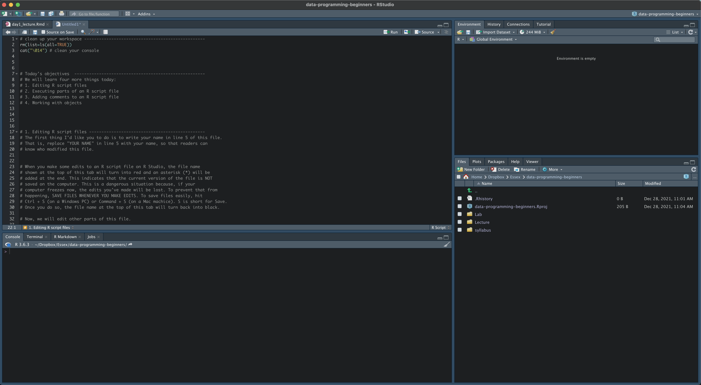
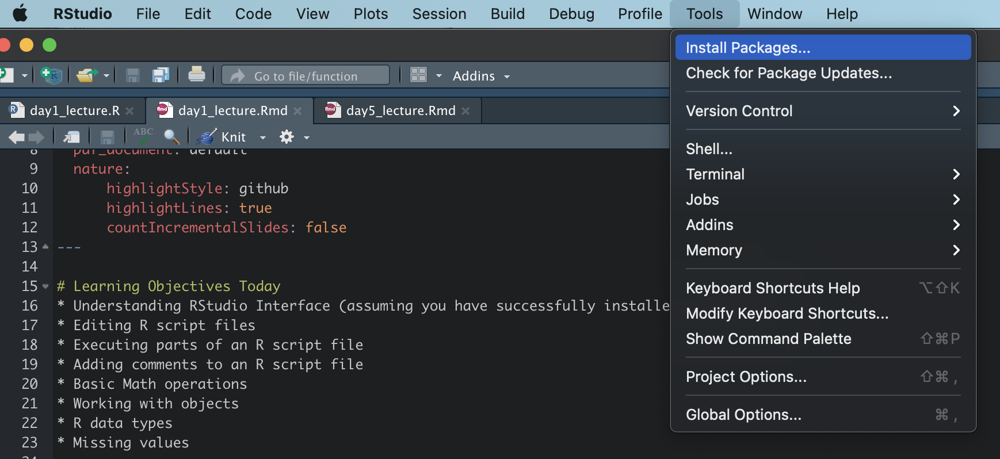
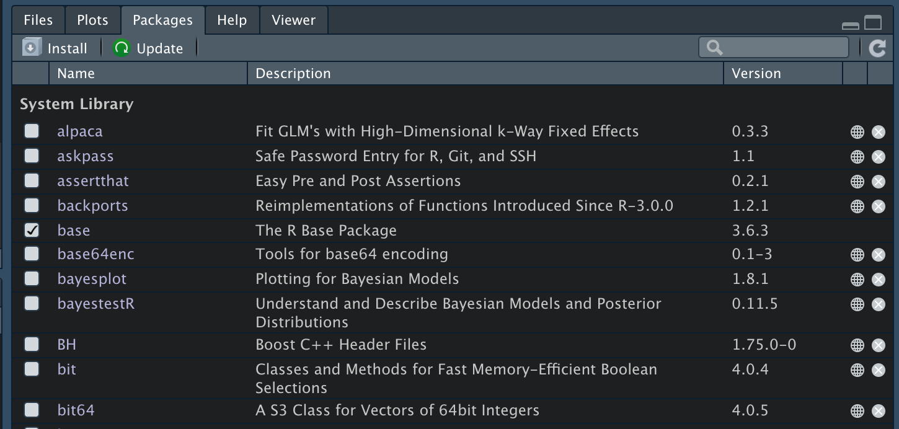
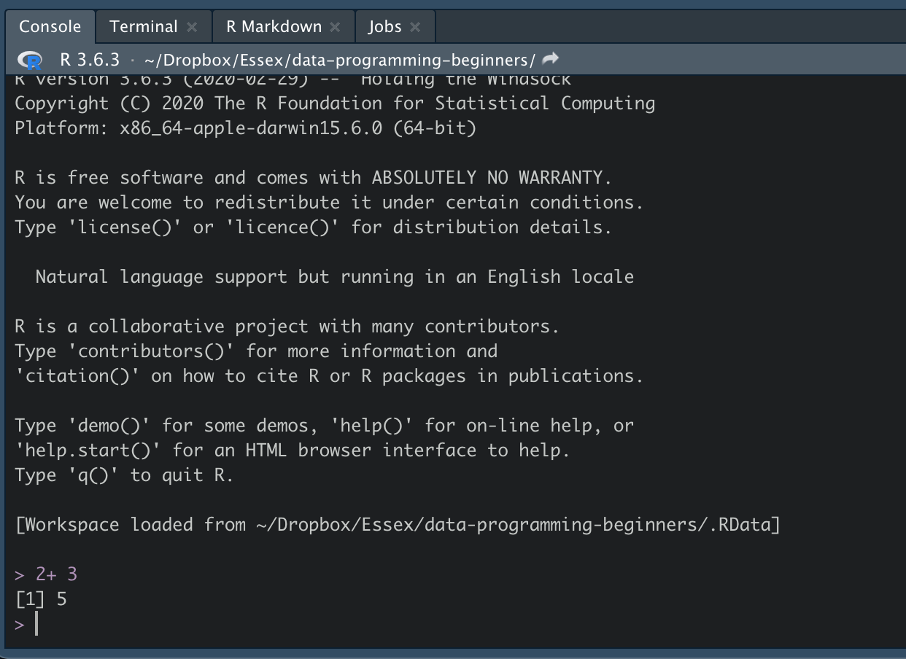
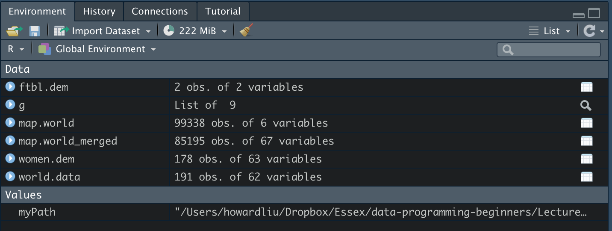
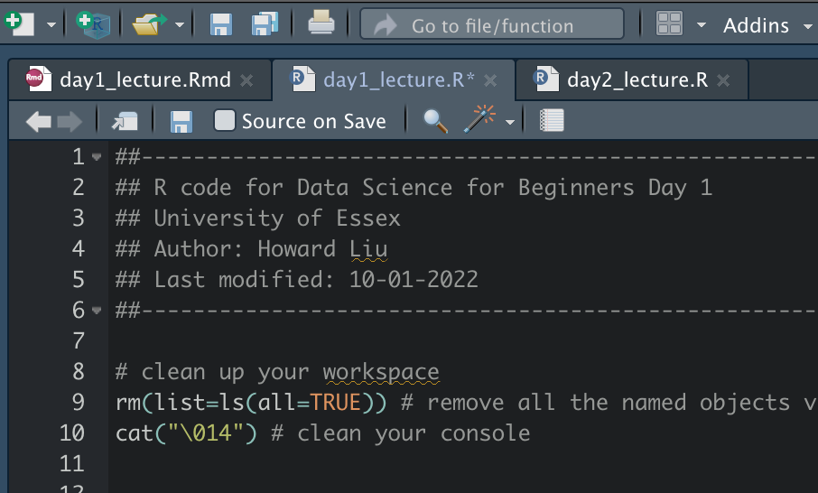

## Learning Objectives Today
0. Understanding RStudio Interface (assuming you have successfully installed R and RStudio)
1. Editing R script files
2. Executing parts of an R script file
3. Adding comments to an R script file
4. Basic math operations
5. Working with **objects**
6. R data types
7. Missing values


# 1.What is R?
R is a free, open source software program for statistical analysis. And it's the most popular language for statistical analysis. 

## What is RStudio?
RStudio is a free, open source IDE (integrated development environment) for R. (You must install R before you can install RStudio.) Its interface is organized so that the user can clearly *view graphs*, *data tables*, *R code*, and *output* all at the same time. It also offers an Import-Wizard-like feature that allows users to import CSV, Excel, SAS (.sas7bdat), SPSS (.sav), and Stata (.dta) files into R without having to write the code to do so.

Let's look around on the interface (e.g., R script, your loaded data, console, files, packages, and plots)

```{r echo=FALSE}
myPath <- "/Users/howardliu/Dropbox/Essex/data-programming-beginners/Lecture/"
setwd(myPath)

```

## Packages
Packages are collections of R functions, data, and compiled code in a well-defined format, created to add specific functionality. There are 10,000+ user contributed packages and growing.

This is where you can load packages manually. Or you can install by using this `install.packages()` command.
```{r echo=FALSE}
myPath <- "/Users/howardliu/Dropbox/Essex/data-programming-beginners/Lecture/"
setwd(myPath)

```

This is a list of packages you have installed. When you need to use any of them, use `library()` command.
```{r echo=FALSE}
myPath <- "/Users/howardliu/Dropbox/Essex/data-programming-beginners/Lecture/"
setwd(myPath)

```

## Console panel
After you write up your R script and hit execute, results will show in the Console:
```{r echo=FALSE}
myPath <- "/Users/howardliu/Dropbox/Essex/data-programming-beginners/Lecture/"
setwd(myPath)

```

If your results are graphs, they will show in the plots.

## Data
You can also view the list of data or objects you have loaded or created.
```{r echo=FALSE}
myPath <- "/Users/howardliu/Dropbox/Essex/data-programming-beginners/Lecture/"
setwd(myPath)

```


# 2. Editing R script files

## Write & Save
When you make some edits to an R script file on RStudio, the file name
shown at the top of this tab will turn into red (in my dark mode it's shown blue) and an asterisk (*) will be
added at the end. This indicates that the current version of the file is NOT
saved on the computer. This is a dangerous situation because, if your 
computer freezes now, the edits you've made will be lost. To prevent that from
happening, SAVE FILES WHENEVER YOU MAKE EDITS. To save files easily, hit 
`Ctrl + S` (on a Windows PC) or `Command + S` (on a Mac machice). S is short for Save.
Once you do so, the file name at the top of this tab will turn back into black.

```{r echo=FALSE}

```

Now, we will edit other parts of this file.

## How to execute your code 
In doing so, keep in mind that we will always try executing commands *piece by piece* in order to see if the commands we write (edit) work properly. In order to execute commands written on an R script file, bring the cursor to the line
that you want to execute, and hit `Ctrl + Enter` (on a Windows PC) or `Command + Enter` (on a Mac machine).

Every time you hit Ctrl + Enter (or Command + Enter), the commands written on a given line are sent to the Console panel and R produces some output. 

It's useful to remember that we can execute *more than one lines* at once. 
To execute multiple lines at once, select multiple lines and hit `Ctrl + Enter` (or Command + Enter). 

For example, select the following two lines and execute them:
```{r, include=T, message=F, warning=FALSE}
3 + 4
7 * 12
```

# 3. Adding comments to an R script file 

When you put # in an R script file, R will assume that whatever texts that
 follow are comments, not commands. If you try executing comments, R will simply
 reproduce what's written without actually executing them. `Command + Shift + "C"` is the shortcut to coment out a chunck of your script. For example, execute
 the following line:
```{r, include=T, message=F, warning=FALSE}
# I don't want to execute the following part because these are for illustration:
# 3 + 4 
```

# 4. Basic math operations
```{r, include=T, message=F, warning=FALSE}
# addition
5 + 7 

# subtraction
7 - 5

# multiplication
7 * 5

# division
7 / 5

# The exp() in R is a built-in mathematical function that calculates the exponential value of a number or number vector, e^x. The value of e is approximately equal to 2.71828. The exp() method takes a number as an argument and returns the floating-point number by calculating e^x.

exp(1)

log(exp(1))

log(exp(5))

5 ^ 2 # squared

5 ^ 3 # cubed 
```

# 5. Working with objects 

R is called an "object-oriented" programming language. This means that 
 we create and modify what's called objects when working with R. 

 Let's now create an object. Execute the command below 
 
```{r, include=T, message=F, warning=FALSE}
my.object <- 12.34 # <- (The shortcut to type up the assignment is option + "-" on Mac) 
my.object2 = 12.34 # In practice, we often just use = because it's much faster to type up
my.object2
```

 What we just did is to create an object called "my.object" and assign 
 a value 12.34 to that object. Put differently, we stored a number 
 12.34 into a new object called "my.object". 

 Look at the symbol in the middle, " <- ".
 This is called the assignment operator (allocation symbol). 
 We use this operator when creating a new object. 

 To take a look at the contents of an object, we simply type its name. 
 Execute the command below.
 
 
```{r, include=T, message=F, warning=FALSE}
# We can tell R to store the answer to an operation. For example, 
my.answer <- 3 + 5 # (Option + "-")
my.answer2 = 3 + 5

# To take a look at this, we run:
my.answer
my.answer2
```


### A few rules about object names

* Rule 1: R is case sensitive!! "X.1" and "x.1" are two different things. 
```{r, include=T, message=F, warning=FALSE}
x.1 <- 12345

# X.1 The second line returns an error message, saying object 'X.1' not found.  This happens because the object we created is x.1, not X.1. 
```


* Rule 2: Objects can be named in many ways, but several names are prohibited. 
  - Object names cannot start with a number
  - Object names cannot start with a period, comma, or underbar
  - Object names cannot have operator symbols, such as +, -, *, /, ^

# 6. R data types

## Vectors
The fundamental building block of data in R is vectors. A vector means an element in R. Vectors means sequences of elements in R. 

```{r, include=T, message=F, warning=FALSE}
# Here is a vector containing three numeric values 2, 3 and 5.
c(2, 3, 5) 

# And here is a vector of logical values.
c(TRUE, FALSE, TRUE, FALSE, FALSE) 

# A vector can contain character strings.
c("aa", "bb", "cc", "dd", "ee")
```


## R has two types of vectors:
1. **atomic** vectors: homogeneous collections of the *same* type (e.g. all logical values, all numbers, or all character strings). We will focus on this in today's lecture because it's the most basic, hence important.

2. **generic** vectors: heterogeneous collections of *any* type of R object, even other lists (meaning they can have a hierarchical/tree-like structure).

R has six atomic vector types: 
<br/>

  `typeof`  |  `mode`     
:-----------|:------------
logical     |  logical   
double      |  numeric    
integer     |  numeric    
character   |  character  
complex     |  complex    
raw         |  raw     

`typeof(x)` - returns a character vector (length 1) of the *type* of object `x`. But I often use `class(x)` instead. 

`mode(x)` - returns a character vector (length 1) of the *mode* of object `x`.
  
### `logical` - boolean values `TRUE` and `FALSE`

```{r, include=T, message=F, warning=FALSE}
typeof(TRUE)
class(TRUE)
mode(TRUE)  
```

### `character` - text strings

```{r, include=T, message=F, warning=FALSE}
typeof("hello world")
mode("hello world")
```
  
### `integer` - integer numerical values (indicated with an `L`)

```{r, include=T, message=F, warning=FALSE}
typeof( 7L )
typeof( 1:3 )

mode( 7L )
mode( 1:3 )
```
  
### *Concatenation*: vectors can be constructed using the concatenate, `c()`, function.

```{r, include=T, message=F, warning=FALSE}
c(1,2,3)

c("Hello", "World!")

c(1,c(2, c(3))) # *Note** - atomic vectors are *always* flat. Only generic vectors (like `lists` will can hierarchical).

class(c(1, 2, "Hello")) # always shown as the same types for every elements in the atomic vectors

newObject = c(1,2,3) # you can assign the vector to an object and then work with it just like before

newWorld = c("Hello", "World!")

# newObject + newWorld # ERROR! You can't add numbers with characters.
```

### **Type Predicates**: The following functions allow you to examine/test what is the type of your object more directly

`is.logical(x)` - returns `TRUE` if `x` has *type* logical.

`is.character(x)` - returns `TRUE` if `x` has *type* character.
 
`is.double(x)` - returns `TRUE` if `x` has *type* double.

`is.integer(x)` - returns `TRUE` if `x` has *type* integer.

`is.numeric(x)` - returns `TRUE` if `x` has *mode* numeric.

```{r, include=T, message=F, warning=FALSE}
is.logical(1)
is.logical(TRUE)
is.logical("Hello World")
```

### Type Coercion
We can also ask R to coerce certain object to a specific type. The most commonly used coercion is converting between number, character, and factor.

P.S. Conceptually, factors are variables in R which take on a limited number of different values; such variables are often refered to as categorical variables.

So let's do an example

```{r, include=T, message=F, warning=FALSE}
object = c(1, 2, 3)

class(object)

object = as.character(object)

class(object)
object

object = as.factor(object)

class(object)
object  
```

# 7. Missing Values

R uses `NA` to represent missing values in its data structures.

Stickiness of Missing Values: Because `NA`s represent missing values it makes sense that any calculation using them should also be missing.

```{r, include=T, message=F, warning=FALSE}
1 + NA
1 / NA
NA * 5

mean(c(1,2,3,NA))
sqrt(NA)
3^NA
```

### Testing for `NA`
To explicitly test if a value is missing it is necessary to use `is.na` (often along with `any` or `all`).
```{r, include=T, message=F, warning=FALSE}
is.na(NA)
is.na(1)
is.na(c(1,2,3,NA))

any(is.na(c(1,2,3,NA)))
all(is.na(c(1,2,3,NA)))

# Or, if you want to know specifically where the na is in your vector, you can use `which` function to help you

which( is.na(c(1, 1, NA, 3)) )
# [1] 3 Now it tells you that the value in position number 3 is an NA
```

  
### Other Special values
  
`NaN` - Impossible values are represented by the symbol NaN (not a number)

`Inf` - Positive infinity

`-Inf` - Negative infinity

```{r, include=T, message=F, warning=FALSE}
0 / 0

3 / 0

-3 / 0
NaN / NA
NaN * NA
```
  
### Testing for `inf` and `NaN`
  
there are still convenience functions for testing for  `NaN` and `Inf` 
```{r, include=T, message=F, warning=FALSE}
is.infinite(Inf)

is.nan(1/0-1/0)
```

### Great! We've finished the first lecture and you can go to day1 exercise to do some additional practices for today's lecture.